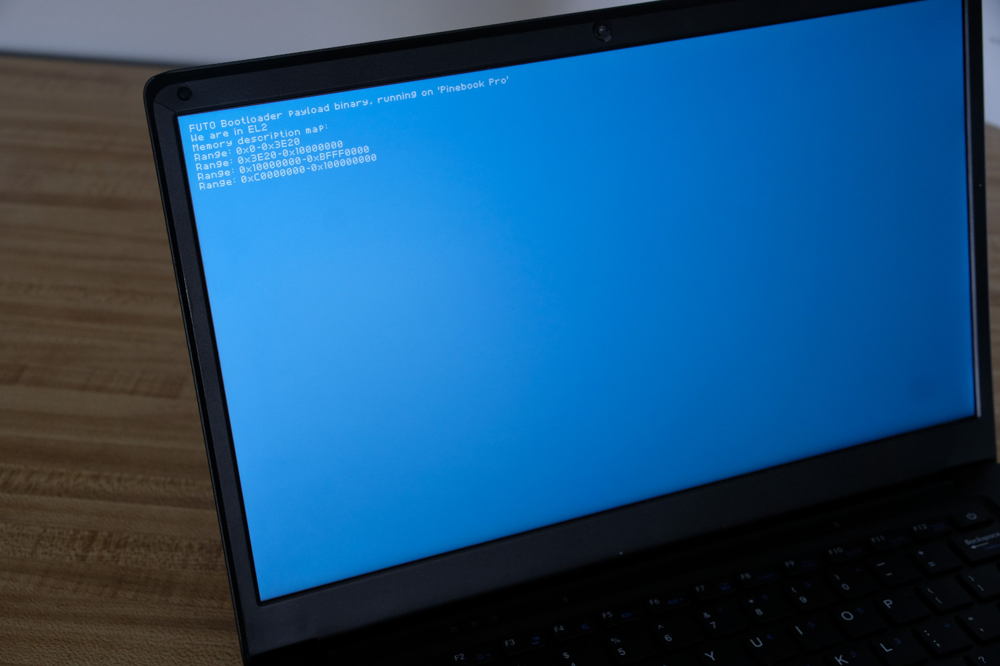

# Bare-Metal Rockchip Firmware

`rk` is a small, multi-board firmware and hardware-bring-up project for
Rockchip RK3399, RK356x, and RK3588 devices. It can run a bare-metal payload
directly, provide framebuffer and keyboard firmware services, or, on explicitly
enabled RK3568 boards, act as the first stage for BL31 and U-Boot so U-Boot can
boot Linux or an EFI application from NVMe, SD, USB mass storage, or eMMC.



## Choose a workflow

| Goal | Output or command | What happens next |
| --- | --- | --- |
| Test a board without installing firmware | `make usb<soc>` | MaskROM USB loads DDR and a demo image into RAM |
| Test bare-metal firmware from SD | Board demo `.img` | Firmware exposes its implemented services and enters the included example payload |
| Develop an EL2 payload | Board `.bin` plus a payload | The firmware initializes the platform and transfers control to EL2 |
| Reach U-Boot on an enabled RK3568 board | `make usb-chainload BOARD=<board>` | BL31 enters that board's U-Boot at EL2; U-Boot scans NVMe, SD, USB, then eMMC |
| Boot an enabled board autonomously | Install its chainloader to SPI NOR or eMMC | BootROM loads the board-qualified first stage without a USB host or SD card |
| Boot YY3568 only from NVMe via SD firmware | `make chainload-media BOARD=yy3568 MEDIA=sd-nvme` | The firmware-only SD image runs U-Boot and scans only NVMe |
| Publish board binaries | `make release-dist VERSION=vX.Y.Z` | Reproducible, checksummed per-board archives are created |

The normal bare-metal firmware is not standalone and is not a storage
bootloader: it expects a FUEFI payload appended immediately after the firmware
and does not contain PCIe, NVMe, or filesystem drivers. A firmware-only `.img`
therefore halts with `Bad payload magic`; use a demo image for a standalone
test. Optional board-scoped chainloaders deliberately delegate storage boot to
U-Boot instead of duplicating it.

U-Boot's EFI Loader can launch `EFI/BOOT/BOOTAA64.EFI`; this repository does
not build EDK2 or claim to be a complete UEFI implementation.

## Supported boards

| Target | SoC | Bare-metal/demo | MaskROM USB | SD image | BL31/U-Boot chainloader |
| --- | --- | --- | --- | --- | --- |
| [Pine64 Pinebook Pro](docs/devices/pinebook.md) | RK3399 | yes | `usb3399` | yes | no |
| [Cool-Pi Genbook](docs/devices/genbook.md) | RK3588 | yes | `usb3588` | yes | no |
| [Firefly ROC-RK3566-PC](docs/rk356x/boards/roc3566.md) | RK3566 | yes | `usb3566` | yes | no |
| [Youyeetoo YY3568](docs/rk356x/boards/yy3568.md) | RK3568 | yes | `usb BOARD=yy3568` | yes | SPI NOR, eMMC, SD, or USB |
| [Radxa ROCK 3A](docs/rk356x/boards/rock3a.md) | RK3568 | yes | `usb BOARD=rock3a` | yes | SPI NOR, eMMC, SD, or USB |
| [Orange Pi 5](docs/devices/orangepi.md) | RK3588 | partial | — | partial | no |

Board support is explicit. Shared SoC code does not make arbitrary RK3566,
RK3568, RK3399, or RK3588 boards safe to use.

## What the bare-metal firmware provides

- DDR initialization through source-built or pinned Rockchip loaders.
- Early UART and board/SoC diagnostics.
- MMU and target-specific memory maps.
- RK3399/RK3588 display support and an RK356x VOP2/DW-HDMI platform.
- Fixed 1920x1080p60 RK356x HDMI output using the basic display path.
- Polled USB HID boot-keyboard input on supported RK356x USB-A ports.
- DTB, framebuffer, memory-map, character-input, and reset services through the
  project's FUEFI interface.
- EL3-to-EL2 payload handoff and reset-to-MaskROM recovery.
- Direct BootROM USB loading and RKNS SD-image packaging.
- Isolated, manifest-driven BL31/U-Boot variants for YY3568 and ROCK 3A.

HDMI audio, hubs and high-speed USB host controllers, networking, storage
drivers in the bare-metal stage, authenticated boot, OP-TEE, and EDK2 remain
out of scope.

## Build and test

On Debian or Ubuntu:

```sh
sudo apt install gcc-aarch64-linux-gnu libusb-1.0-0-dev make xxd \
  device-tree-compiler cpp python3 xz-utils
make all
make SHELL=/bin/bash check -j"$(nproc)"
```

`make all` builds the normal/demo firmware and host utilities. It does not
fetch or build U-Boot. The required RK356x binary inputs are vendored in
`img/`, so ordinary clean builds do not require sibling `rkbin` or
`Rockchip-Library` checkouts.

Artifact naming is consistent:

- `<board>.bin`: firmware-only developer base; append a compatible payload.
- `demo_<board>.bin`: firmware with the demo payload appended.
- `<board>.img`: SD-packaged firmware-only base; not standalone.
- `demo_<board>.img`: standalone SD demonstration image.
- `uboot_<board>.bin`: dedicated board first stage plus its pinned U-Boot FIT.
- `uboot_<board>.img`: board-qualified BL31/U-Boot SD image.
- `uboot_yy3568_sd_nvme.img`: YY3568 firmware-only SD image whose automatic
  boot command scans only NVMe.
- `uboot_<board>_idbloader.img`: raw eMMC ID block for LBA `0x40`.
- `uboot_<board>_spi.img`: raw RKNS v2 SPI-NOR ID block for LBA `0x40`.

See [Getting started](docs/intro.md) for release-vs-source workflows, direct
USB loading, SD usage, serial settings, and recovery expectations.

## RK356x: U-Boot, storage discovery, and autonomous boot

Chainloading is enabled only for boards with validated manifests. Build and
validate one selected board without affecting its normal/demo firmware:

```sh
make chainload BOARD=yy3568
make chainload-check BOARD=yy3568
make chainload-media BOARD=yy3568 MEDIA=sd-nvme
make usb-chainload BOARD=yy3568

make chainload BOARD=rock3a
make chainload-check BOARD=rock3a
make usb-chainload BOARD=rock3a
```

The resulting flow is:

```text
SPI NOR / eMMC / SD / MaskROM USB
  -> RK3568 BootROM
  -> Rockchip DDR loader
  -> board-isolated rk RK3568 chainloader
  -> BL31
  -> U-Boot EL2
  -> board-specific SD/NVMe/eMMC/SCSI/USB/network policy
  -> extlinux, boot.scr, or EFI/BOOT/BOOTAA64.EFI
```

YY3568 pins official mainline U-Boot v2026.07; ROCK 3A pins official mainline
U-Boot v2026.04. Each manifest selects its own source, overlay, addresses,
boot policy, and artifacts. The build is opt-in and normally fetches that
pinned source commit.

The YY3568 build also produces `uboot_yy3568_sd_nvme.img` from a second clean
snapshot of the same commit. The image puts upstream U-Boot's complete
`u-boot-rockchip.bin` binman output at LBA 64; it does not use the repository's
custom first stage. Its policy difference is `bootflow scan -lb nvme`; an
absent or unbootable NVMe returns to the U-Boot prompt instead of scanning SD,
eMMC, SCSI, USB, or network.

Both manifests explicitly map their board aliases so `mmc1` selects the
removable SD slot, `mmc0` selects eMMC, and onboard `mmc2` SDIO is never scanned
as OS storage.
Use `UBOOT_SRC=/path/to/pinned/source` for an existing source tree, or
`UBOOT_ITB=/path/to/u-boot.itb` for an offline `.bin` development build.
Persistent-media images additionally require the pinned U-Boot `mkimage` or
an explicit `MKIMAGE=/path`.

SPI NOR has immutable BootROM priority over eMMC, SD, and USB. Installation is
therefore guarded by exact confirmation strings, capacity checks, mandatory
backups, MBR/GPT overlap checks for eMMC, and complete readback verification.
Read the [chainloading and installation guide](docs/rk356x/chainloading.md)
before writing either device, and follow the dedicated [guarded SPI-NOR
tutorial](docs/rk356x/spi-nor.md) for persistent SPI installation.

## Documentation

- [Getting started and choosing a workflow](docs/intro.md)
- [Firmware images, payloads, SD delivery, and device trees](docs/payloads.md)
- [RK356x device overview and board matrix](docs/rk356x/index.md)
- [RK356x common bare-metal firmware, memory, display, and input](docs/rk356x/bare-metal.md)
- [RK356x BL31/U-Boot, SPI/eMMC, NVMe, recovery, and future EDK2/OP-TEE integration](docs/rk356x/chainloading.md)
- [Guarded RK356x SPI-NOR flashing tutorial](docs/rk356x/spi-nor.md)
- [ROC-RK3566-PC board policy](docs/rk356x/boards/roc3566.md)
- [YY3568 board policy](docs/rk356x/boards/yy3568.md)
- [ROCK 3A board policy](docs/rk356x/boards/rock3a.md)
- [Binary releases and checksum verification](docs/releases.md)
- [Chainloader board-manifest and porting policy](config/chainload/README.md)
- [Rockchip binary provenance](img/README.md)
- [Bare-metal reference index](docs/index.md)

## Binary releases

Stable `vMAJOR.MINOR.PATCH` tags publish reproducible archives for Pinebook Pro,
Genbook, ROC-RK3566-PC, YY3568, and ROCK 3A plus a top-level `SHA256SUMS`. The partial
Orange Pi 5 target and Linux host executables are intentionally not release
assets. See the [release guide](docs/releases.md).

## Validation status

Host tests cover image formats, FIT parsing, address policies, input
logic, guarded SPI/eMMC installation, backup restoration, release allowlists,
and reproducibility contracts. Physical-board acceptance is separate: before
depending on a persistent image, capture the required UART transcript and
complete the hardware checklist in the relevant board guide.

## Thanks

- Colt Judice
- Hans Jorgensen
- Hannes Bredberg
- Andreas Dannenberg

Copyright FUTO (C) 2025 FUTO
