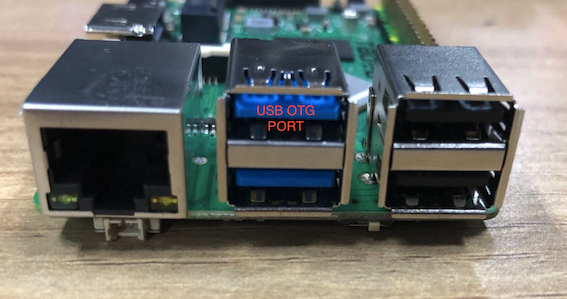
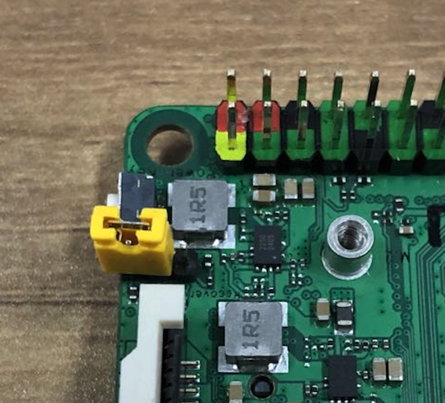
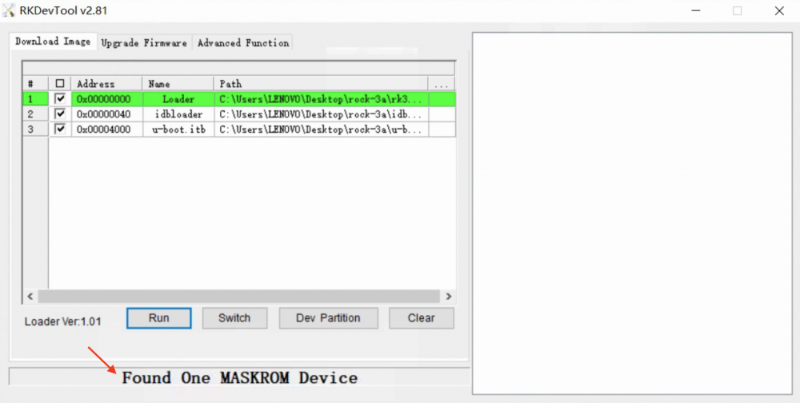

# Flash SPI NOR safely

This guide installs the board-qualified RK3568 chainloader into SPI NOR so
the BootROM can start BL31 and U-Boot without an SD card or USB host. U-Boot
then follows the selected board's manifest-defined local and network OS search
order.

The guarded installer supports only these explicitly described boards:

- [Radxa ROCK 3A](boards/rock3a.md), selected as `BOARD=rock3a`.
- [Youyeetoo YY3568](boards/yy3568.md), selected as `BOARD=yy3568`.

!!! danger
    SPI NOR is persistent and has higher BootROM priority than eMMC, SD, and
    ordinary USB fallback. Use only the guarded commands below. They require
    a complete backup and verify every written byte before reset.

    Do not substitute raw `rkdeveloptool wl` commands and do not run
    `rkdeveloptool ef`. Those operations bypass this project's board,
    capacity, backup, and readback protections.

## Before you start

You need:

- A supported board with a populated JEDEC-compatible SPI NOR.
- A Linux programming host with `xrock` and `rkdeveloptool` built at the
  pinned commits documented in [Prepare a Linux programming
  host](../intro.md#prepare-a-linux-programming-host).
- The correct recovery control and USB OTG connection for the selected board.
- An absolute, new or empty backup directory on storage other than the target
  board.
- UART2 access at 1,500,000 baud, 8N1 for boot evidence.
- If the goal is OS boot, an NVMe device already prepared for extlinux,
  `boot.scr`, or `EFI/BOOT/BOOTAA64.EFI`.

Confirm the host tools before connecting the board:

```sh
command -v xrock
command -v rkdeveloptool
rkdeveloptool -h | grep ChangeStorage
```

The expected build flow and automatic OS discovery are described in the
[RK356x chainloading guide](chainloading.md). SPI NOR contains only the first
stage, BL31, and U-Boot; it does not contain Linux or a root filesystem.

## 1. Build and validate the SPI image

For ROCK 3A:

```sh
make chainload BOARD=rock3a -j"$(nproc)"
make chainload-check BOARD=rock3a
```

The important outputs are:

```text
uboot_rock3a_spi.img
uboot_rock3a.bin
rock3a-u-boot.itb
```

For YY3568:

```sh
make chainload BOARD=yy3568 -j"$(nproc)"
make chainload-check BOARD=yy3568
```

The corresponding outputs are:

```text
uboot_yy3568_spi.img
uboot_yy3568.bin
yy3568-u-boot.itb
```

Do not rename or exchange artifacts between boards. The generated image,
memory policy, U-Boot configuration, and recovery metadata are board-scoped.

## 2. Enter MaskROM mode

Power the board off before changing jumpers or connecting the recovery cable.
Remove removable boot media that could make diagnosis ambiguous.

### ROCK 3A physical connection

Use the upper blue USB 3 connector as the ROCK 3A USB OTG port. The reference
procedure uses a USB-A male-to-male cable; connect the other end to the Linux
host.



With power removed, fit the SPI-disable/MaskROM jumper shown below. Power the
board, then remove the jumper after MaskROM enumeration. Do not short any
other pins.



### YY3568 physical connection

Use the YY3568 recovery/MaskROM control and its documented USB OTG connector.
The ROCK 3A photos above do not describe YY3568 headers or connector wiring.

### Confirm enumeration

On the Linux host:

```sh
rkdeveloptool ld
```

There must be exactly one device in MaskROM mode, similar to:

```text
Vid=0x2207 Pid=0x350a Mode=Maskrom
```

If valid SPI firmware is already installed, the BootROM normally selects it
before eMMC, SD, or USB. Use the board's hardware recovery control to force
MaskROM instead of relying on normal USB fallback.

The screenshot below is only a visual reference for the `Found One MASKROM
Device` state in Rockchip's Windows utility. This project does not provide a
guarded Windows flashing procedure; perform all writes from the Linux host.



## 3. Flash with a complete backup

The backup path must be absolute, new or empty, and have enough free space for
the complete detected SPI NOR.

For ROCK 3A:

```sh
make flash-chainload \
  BOARD=rock3a \
  MEDIA=spi-nor \
  BACKUP_DIR=/absolute/path/rock3a-spi-backup \
  CONFIRM=rock3a:spi-nor
```

For YY3568:

```sh
make flash-chainload \
  BOARD=yy3568 \
  MEDIA=spi-nor \
  BACKUP_DIR=/absolute/path/yy3568-spi-backup \
  CONFIRM=yy3568:spi-nor
```

From a release archive, invoke the packaged installer directly with the same
board-qualified policy. For example:

```sh
./install/flash-chainload.sh flash rock3a spi-nor \
  /absolute/path/rock3a-spi-backup rock3a:spi-nor
```

The installer performs these operations in order:

1. Requires exactly one RK356x USB device.
2. Loads the manifest-selected DDR and USB-plug helpers into RAM.
3. Selects SPI NOR with `rkdeveloptool cs 9`.
4. Validates the JEDEC identity and detected capacity.
5. Backs up the complete chip as `complete-spi-nor.bin`.
6. Writes only the required `uboot_<board>_spi.img` range at LBA `0x40`
   (byte offset `0x8000`), preserving SPI sectors 0-63.
7. Reads the written range back and requires an exact byte-for-byte match.
8. Resets only after verification succeeds.

Keep `backup.json`, `complete-spi-nor.bin`, the range backups, and
`SHA256SUMS` together. If verification fails, the device stays in loader mode
and the installer prints the exact restore command.

## 4. Verify the boot source and NVMe search

Connect UART2 at 1,500,000 baud, 8N1 before resetting. A successful BootROM
handoff from SPI NOR begins with first-stage evidence containing:

```text
source=spi-nor
```

YY3568 U-Boot provides a three-second interruption window and then searches:

```text
removable SD -> NVMe -> eMMC -> SCSI -> USB -> PXE -> DHCP
```

If U-Boot starts but does not find the operating system, interrupt autoboot
and inspect the NVMe path:

```text
pci enum
nvme scan
nvme info
part list nvme 0
```

That is an NVMe discovery or boot-content problem, not an SPI programming
failure. See [U-Boot automatic OS
discovery](chainloading.md#u-boot-automatic-os-discovery) for the accepted
boot layouts.

## Restore the original SPI contents

Force the same board back into MaskROM, attach exactly one RK356x device, and
use the board and medium recorded in `backup.json`. For example:

```sh
make restore-chainload \
  BACKUP=/absolute/path/rock3a-spi-backup \
  CONFIRM=restore:rock3a:spi-nor
```

For YY3568, use its own backup directory and
`CONFIRM=restore:yy3568:spi-nor`. Restoration rejects mismatched board names,
media, manifest hashes, capacities, or saved ranges. Never restore one board's
backup onto another board.

After restoring ROCK 3A SPI and resetting, remove the recovery jumper. A
restored or blank SPI permits the BootROM to continue to its lower-priority
media.

## Image attribution

The three photographs and screenshots on this page are adapted from Radxa's
[Install the image to SPI Nor Flash](https://wiki.radxa.com/Rock3/install/spi)
guide. Copyright Radxa Computer (Shenzhen). They are redistributed under the
[Creative Commons Attribution 3.0 Unported
License](https://creativecommons.org/licenses/by/3.0/). Exact source URLs,
dimensions, byte sizes, and SHA-256 hashes are recorded beside the local
assets in [`SOURCES.txt`](../img/rk356x/spi-nor/SOURCES.txt).
